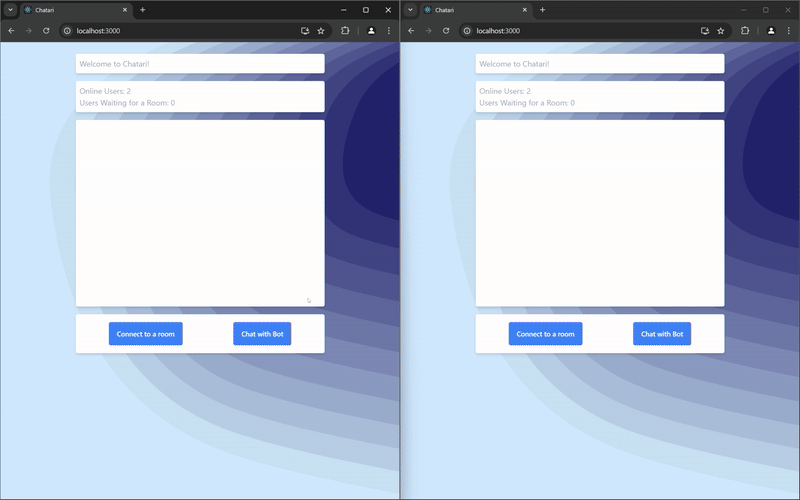
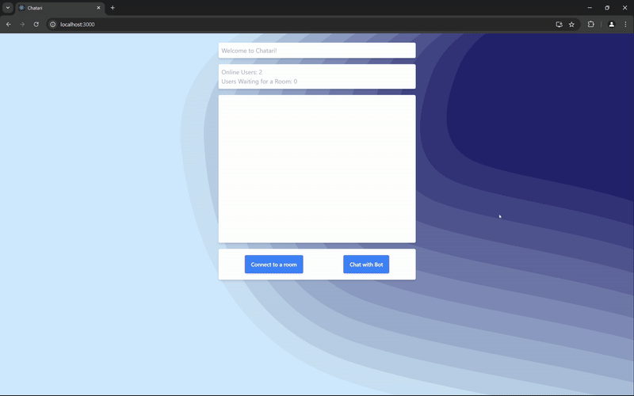

# Chatari Client 💬

Chatari is a React-based chat client built with Create React App and TailwindCSS. It allows users to either join a real-time chat room with other users or chat with a bot via socket communication on port 3001.

## Showcase 🎥

Here are some GIFs showcasing the website:

### Chatting with a user 👥



### Chatting with a bot (GPT-4) 🤖



## Features ✨

- **Real-time Chat:** Connect to a room and chat with other users.
- **Bot Chat:** Option to chat with a bot.
- **Typing Indicator:** Displays when the other party is typing.
- **Real-time User Info:** Shows online users and users waiting for a chat.

## Project Structure 📁

- **public/**  
   Contains static assets and the HTML template.
- **src/**
  - [App.tsx](src/App.tsx) – Renders the chat app and a background.
  - **components/**
    - [ChatApp.tsx](src/components/ChatApp.tsx) – Implements the chat logic and socket integration.
    - [Background.tsx](src/components/Background.tsx) – Renders a decorative SVG background.

## Getting Started 🚀

1. **Install Dependencies:**

   ```sh
   yarn install
   ```

2. **Start the Development Server:**

   ```sh
   yarn start
   ```

   This starts the React app on [http://localhost:3000](http://localhost:3000).

3. **Backend Server:**

   Ensure that a Socket.IO server is running on `http://localhost:3001` for handling real-time chat events.

## Available Scripts 📜

In the project directory, you can run:

- **`yarn start`**  
   Runs the app in development mode.

- **`yarn build`**  
   Builds the app for production to the `build` folder.

- **`yarn test`**  
   Launches the test runner.

- **`yarn eject`**  
   Removes the single build dependency from your project. **Note:** This is a one-way operation.

## Learn More 📚

- Learn [React](https://reactjs.org/) for building user interfaces.
- Read the [Create React App documentation](https://facebook.github.io/create-react-app/docs/getting-started) for more details.

## License 📄

This project is open source and available for modification.
